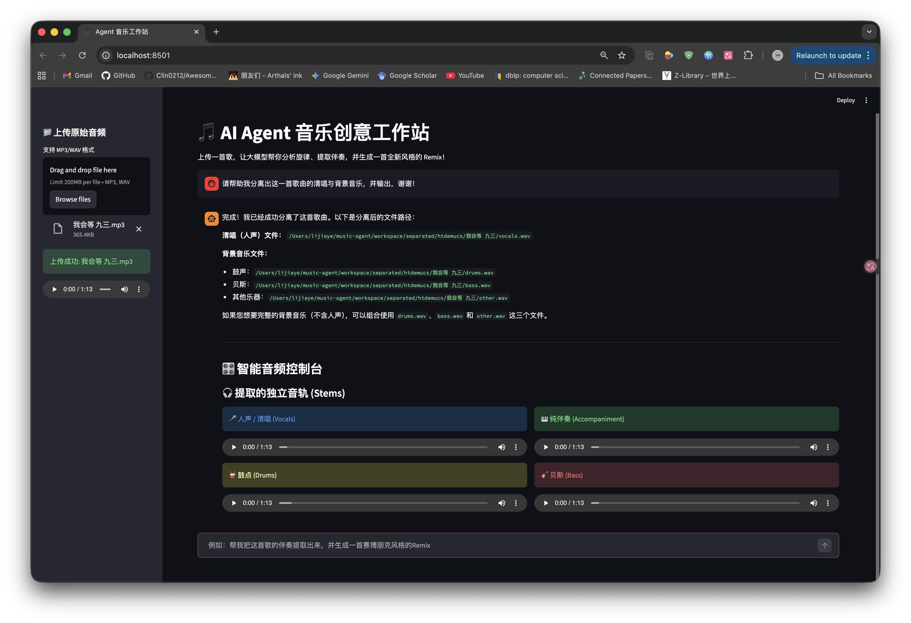
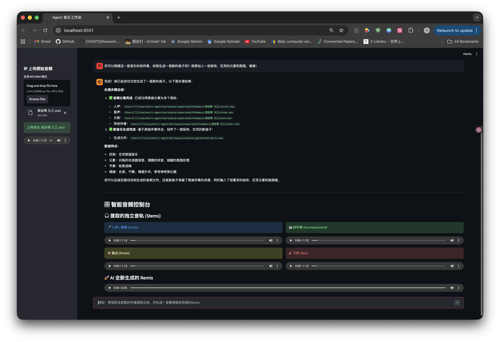

# MuseAgent: Agentic-Audio-Workstation

## 📖 Introduction
**Music-Agent** is an intelligent workflow automation system driven by Large Language Models (LLMs). It acts as a virtual "Music Producer," capable of understanding complex natural language instructions and orchestrating various advanced audio processing models via **Function Calling / Tool Use**.

**The Anti-Blackbox Philosophy:** Unlike end-to-end commercial generators (e.g., Suno, Udio) that completely overwrite the original musical structure, Music-Agent is designed as a "surgical scalpel" for music manipulation. It decomposes the creative process into transparent, controllable steps (Separation -> Transcription -> Generation), giving users precise, fine-grained control over style transfer and remixing while preserving the core melody and MIDI skeleton of the original track.

## 📸 UI Showcase

**1. Smart Intent Recognition & Dynamic 4-Track Console**
When requested to simply isolate vocals, the Agent dynamically routes the task *only* to the separation module, bypassing generation to save compute. The Streamlit UI reacts by rendering a beautiful, interactive 4-track stem player.

**2. Full Pipeline Execution (Separation -> Transcription -> Generation)**
When commanded to remix a track into a new style, the Agent executes the full Chain-of-Thought pipeline. It presents a detailed workflow summary alongside the newly generated local audio.

## ✨ Core Features
* 🧠 **Dynamic LLM Agent Brain:** Powered by DeepSeek, the agent features a strict **Dynamic Routing** system. It accurately recognizes user intent to trigger only the necessary tools, preventing wasteful execution and saving compute resources.
* 🎛️ **Smart Stem Separation:** Automatically isolates vocals, drums, bass, and other instruments from a mixed audio track using Demucs.
* 🎼 **Audio-to-MIDI Transcription:** Converts isolated instrumental audio tracks directly into playable and editable MIDI sheet music using Spotify's Basic-Pitch.
* 🚀 **Local Hardware-Accelerated Generation:** Synthesizes new audio segments based on text prompts using Meta's MusicGen. Fully optimized to run locally on Apple Silicon (M-series chips) via PyTorch MPS backend.
* 💻 **Interactive Web UI:** A clean, reactive interface built with Streamlit, featuring a **Dynamic 4-Track Audio Console** that instantly visualizes and plays separated stems or generated remixes.

## ⚙️ Hardware Requirements & Limitations
* **Local Music Generation:** To bypass cloud API rate limits, the `generate_music` tool runs **entirely locally** using Meta's MusicGen-Small (300M parameters). It requires a machine with robust local compute capabilities (e.g., Apple Silicon M1/M2/M3 with MPS enabled, or an NVIDIA GPU with CUDA).
* **Generation Length Cap:** Due to the severe memory constraints of running Transformer-based audio models locally (especially on devices with 8GB unified memory), the default generation length is strictly capped at **~5 seconds (256 tokens)**. Attempting to generate longer sequences locally may result in Out-Of-Memory (OOM) crashes or unacceptably long inference times.

## 📂 Project Structure

~~~text
music-agent/
├── app.py                 # Streamlit UI with Dynamic Audio Console
├── agent/
│   ├── __init__.py
│   └── core.py            # LLM intent parsing, dynamic routing, and Function Calling
├── tools/
│   ├── __init__.py
│   ├── separator.py       # Demucs stem separation wrapper
│   ├── transcriber.py     # Basic-Pitch MIDI conversion wrapper
│   └── generator.py       # Local MusicGen inference (MPS/CUDA supported)
├── workspace/             
│   ├── inputs/            # User uploaded audio
│   ├── separated/         # Isolated 4-track stems
│   ├── midi_outputs/      # Extracted MIDI files
│   └── outputs/           # Final generated audio remixes
├── requirements.txt       # Project dependencies
└── README.md              # Project documentation
~~~

## 🛠️ Quick Start

### 1. Prerequisites
* Python 3.10 or higher.
* [FFmpeg](https://ffmpeg.org/) installed on your system.
  * Mac: `brew install ffmpeg`
  * Ubuntu: `sudo apt install ffmpeg`

### 2. Installation
Clone the repository and install the required Python packages:
~~~bash
git clone https://github.com/yourusername/music-agent.git
cd music-agent
pip install -r requirements.txt
~~~

### 3. Environment Variables
Create a `.env` file in the root directory and add your LLM API key:
~~~env
DEEPSEEK_API_KEY=your_api_key_here
~~~

### 4. Run the Application
Launch the interactive Streamlit workstation:
~~~bash
streamlit run app.py
~~~

## 🗺️ Future Roadmap
- [ ] **Piano Roll Visualization:** Integrate `pretty_midi` and interactive plotting libraries to visually render the transcribed MIDI skeletons directly in the Web UI.
- [ ] **Advanced Length Control:** Dynamically calculate token generation length based on user prompts.
- [ ] **Target Speaker/Singer Extraction:** Explore conditioned source separation to isolate specific overlapping vocals.

## 🙏 Acknowledgements
This project stands on the shoulders of giants. We deeply appreciate the open-source community:
* **[Demucs](https://github.com/facebookresearch/demucs):** State-of-the-art music source separation by Meta Research.
* **[Basic-Pitch](https://github.com/spotify/basic-pitch):** A lightweight, fast audio-to-MIDI converter by Spotify.
* **[MusicGen](https://huggingface.co/facebook/musicgen-small):** An auto-regressive Transformer model for music generation by Meta.
* **[DeepSeek]:** For providing robust LLM reasoning and Function Calling capabilities.
* **[Streamlit](https://streamlit.io/):** For the rapid development of the interactive Web UI.

## ⚠️ Disclaimer
This project is developed solely for **educational and research purposes**. The developers do not host or distribute any copyrighted audio material. Users are strictly responsible for ensuring they have the appropriate rights, licenses, and permissions for any audio files processed or generated using this tool.